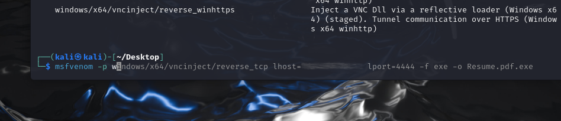
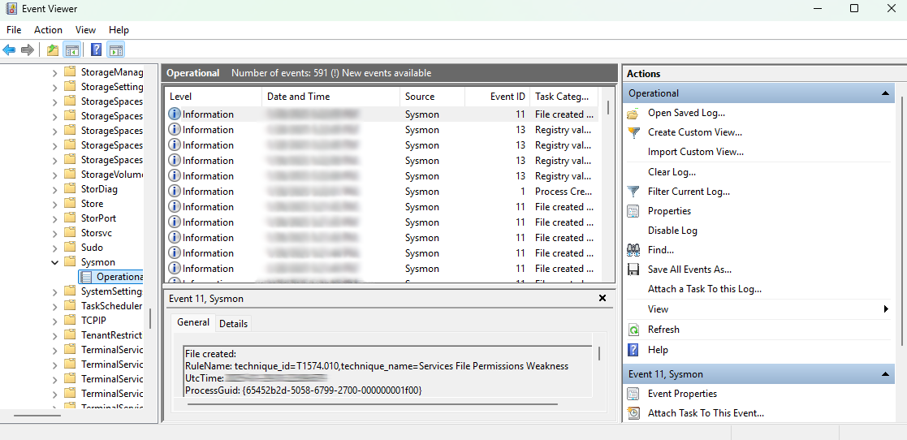
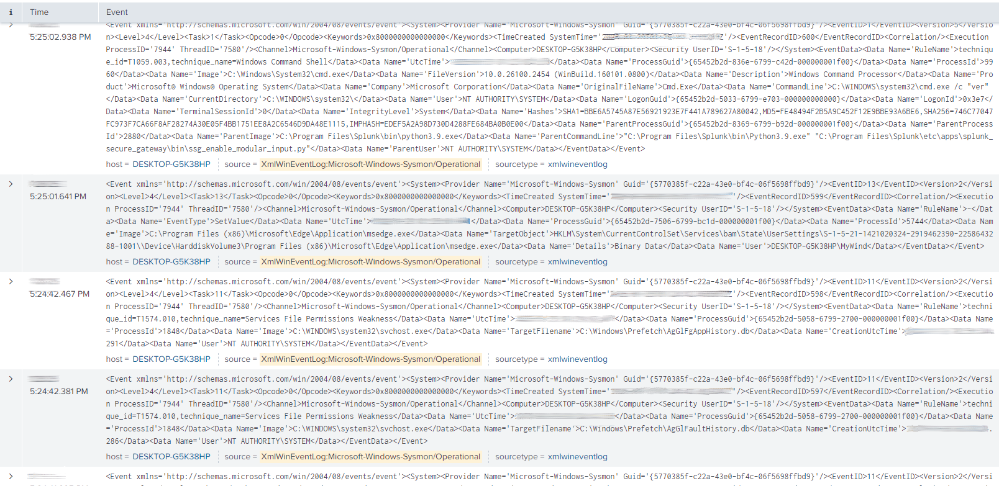
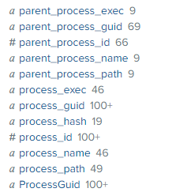

# Introduction
## Credit:
https://www.youtube.com/watch_videos?video_ids=kku0fVfksrk,5iafC6vj7kM,-8X7Ay4YCoA
## About
I created a list of projects/tools that I wanted to use to obtain the knowledge of a cybersecurity analyst. Most of the tools would fit within a deployment, analysis, data storage, and remediation of a honeypot. While a honeypot is a lab that I yearned to start out with, I realized that I needed experience with malware that I could predict rather than malware that could come from any source. This is why I aimed to create a home lab to analyze custom malware.
## Overview
The aim of this project is to familiarize myself with virtual machines, malware, telemetry, Splunk, and Sysmon in order to analyze and manage events related to malicious behavior.
### Tools
- VirtualBox
- Splunk
- Windows
- Kali Linux
- BASH
- MSFvenom
- Sysmon
### Goals
- Create attacker & defender virtual machines
- Attack the defender w/malware
- Monitor & analyze events
- Create a detection rule to identify & prevent malware
- Write remediation steps
- Place controls to prevent attack from occurring in the first place
# Process
## Steps
Prep:
1. Create Kali and Windows virtual machines
2. Configure Kali and Windows machines:
	1. Set up an internal network
	2. Manually assign IPs to each machine
3. Download Splunk, Sysmon, and Splunk addon for Sysmon on Windows machine, then configure Splunk's inputs.conf file to ingest Sysmon data
4. Create an endpoint index in Splunk & confirm its creation by using the "index=endpoint" search term in "Search & Reporting"
Generate telemetry:
1. nmap scan the Window's machines ports from the Kali's terminal
2. Create malicious payload using MSFvenom
3. Deliver the payload via an http server
4. Download & run the payload on Windows after turning off defender
5. With a now established connection to the windows machine, establish a shell from Kali and execute some commands
Splunk analyzation:
1. Search for index=endpoint (Kali machine's IP)
2. Continue in extended lab (to be continued...):
	1. Create a detection rule to identify & prevent malware
 	2. Write remediation steps
	3. Place controls to prevent attack from occurring in the first place
## Troubleshooting
### Splunk
#### Localhost could not connect
Network status on virtual machine: not connected
- On the network, localhost connected just fine, but offline, localhost could not connect.
- To investigate further, I researched a few things about localhost:
	- Localhost is the local machine itself and is most commonly accessed via the IP address 127.0.0.1.
		- This connection is when the computer is talking to itself.
	- Therefore, internet connection is not required to connect to localhost
##### Correction
1. Check if Splunk is running
	- Open cmd prompt as administrator and enter:
		1. **cd "C:\Program Files\Splunk\bin"**
		2. **splunk status**
	- Result: Splunkd: stopped
2. Start Splunk:
	1. Enter splunk start
	3. Notable Results:
		- **Splunk> Finding your faults, just like mom** < that was alarming to see haha
		- **Checking indexes...**
			- **(skipping validation of index paths because not running as LocalSystem)**
				- *That's odd*, I *installed* Splunk as a LocalSystem but it's not *running* as a LocalSystem
					- [[Full Results]]
					- Though I thought this was mysterious, a simple search on Splunk's website provided 3 simple commands:
						- **splunk stop**
						- **splunk enable webserver**
						- **splunk start**
						- (Thanks https://community.splunk.com/t5/Splunk-Search/Splunk-is-not-working-localhost-refused-to-connect/m-p/396838)
		- After running the above commands, the results was successful: **Waiting for web server at http:\//127.0.0.1:8000 to be available.. Done**
### Windows 11 IP Config Defaults to automatic
For this lab, I needed to configure the IPs of both machines. On Kali Linux, this was no problem, but the Windows machine kept defaulting to automatic IPv4 Assignment.
#### Correction:
	- Windows + r
	- Disable DHCP process
		- This is not completely possible due to lack of privilege, but most of its sub-processes can be disabled and "start on startup" can also be disabled
	- After this, I confirmed that the two machines could communicate by pinging the Kali IPv4 address from the windows machine
### RDP is not open
I disabled the firewalls on the windows host through the regular user-oriented windows defender settings. Perhaps this was not a complete method to turn off all of the firewalls. Upon nmap scanning the windows machine, many ports were still closed and the example port (3389) was not visible in the scan results.
- Received ports:
	- 135
	- 139
	- 445
- "Not shown: 997 closed tcp ports (conn-refused)"
#### Correction:
##### Part 1
Error:
- Unable to open /etc/resolv.conf
	- Unable to determine any DNS servers. Reverse DNS is disabled. Try using --system-dns or specify valid servers with --dns-servers
As per https://community.infosecinstitute.com/discussion/125447/nmap-problems-perhaps-someone-can-help, the best solution seemed to be to write a valid nameserver entry into the resolv.conf file. 
- I did this by using the command:
```
sudo echo "nameserver 8.8.8.8" | sudo tee /etc/resolv.conf
```
However, this did not lead to nmap finding the RDP port
##### Part 2
3 ports already displayed as open and the resolv.conf valid nameserver entry fix did not resolve the missing RDP port scan. So the next step I took was actually checking if 3389 was actually closed. to do this, I ran the following:
```
nmap -p 3389 kaliip
```
##### Part 3 - Final
RDP was not turned on in the Windows machine's settings. After turning it on, nmap was able to discover port 3389
### index=endpoint search has no results in Splunk
After downloading the malware from the Kali machine, configuring Splunk's .conf file, creating a new index in Splunk called "endpoint," searching for "index=endpoint" yielded no search results
#### Possible solution
I only placed the new .conf file into /Splunk/etc/local, not the default location: /Splunk/etc/default. I might need to place it in the default location as well
- This was likely the issue
- Process:
	- After coming back another day and re-starting the telemetry process between the Kali and Windows machines, I was able to see log events
### index=endpoint (Kali IP) and index=endpoint Resume.pdf.exe yield no results
After attempting to search for the Kali machine's IP and the malicious file "Resume.pdf.exe," the search yielded no results
- Initially, I did not have RDP enabled on the Window machine as the original creator of this lab did. I tried to backtrack a bit by nmap scanning the windows machine after enabling RDP to see if this scan appeared in Splunk. It did not
#### Correction
##### Part 1
Redo the payload creation, delivery, execution, etc.
##### Part 2

I thought the intended palyoad was "windows/64/meterpreter_reverse_tc," I found that there was a different payload in the command's history. Maybe I accidentally used the wrong one?
##### Part 3
I did not install Sysmon
- I realized this once the extra sysmon fields were not showing after configuring the inputs.conf file

After installingSysmon and restarting Splunk, I thought the additional fields still were not available, so to confirm that Sysmon and Splunk were working properly, I:
1. Verified that Sysmon is Generating Logs:
	- I visited the event viewer (`eventvwr.msc`) and navigated to: `Applications and Services Logs > Microsoft > Windows > Sysmon > Operational`
	- There were in fact logs present 
2. Confirmed that Splunk is Collecting the Logs
	- By conducting the search: `index=* source="XmlWinEventLog:Microsoft-Windows-Sysmon/Operational"` I confirmed that Splunk also collected the logs![[Pasted image 20250128173238.png]] (***remember to blur or crop out time stamps***)
3. Finally, I re-checked the fields and sure enough, the additional fields were there:
	- 
#### Final Solution
- Installing Sysmon finally allowed me to see the extra fields and parse through them and view the telemetry that was create via the Kali machine
- I was able to view the EventCode field:

